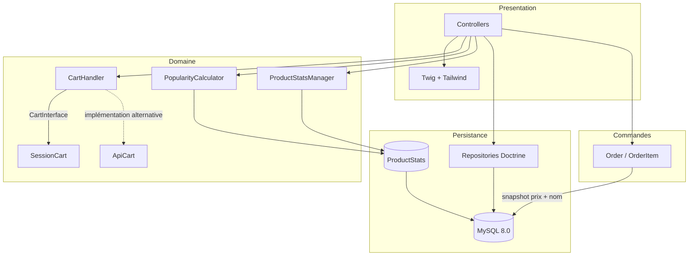

# Minimalist Store — boutique e-commerce Symfony

Boutique e-commerce complète construite avec Symfony 7.3 : catalogue filtrable,
panier interchangeable via le pattern Strategy, commandes historisées de façon
immuable et classement produits par score de popularité calculé automatiquement.

---

## Aperçu

Le projet répond à un problème classique des catalogues e-commerce : **comment
classer les produits sans figer le tri, et comment garder un historique de
commandes fiable quand les prix bougent ?**

Deux mécanismes y répondent, volontairement indépendants l'un de l'autre :

- un **score de popularité** recalculé à partir des interactions réelles
  (vues, ajouts au panier, achats) ;
- un **flag éditorial `isTop`**, piloté à la main depuis le back-office, pour
  mettre en avant un produit indépendamment de ses performances.

Côté commandes, chaque ligne stocke un **snapshot** du nom et du prix au moment
de l'achat : une baisse de prix ou la suppression d'un produit ne réécrit jamais
l'historique.

---

## Stack technique


| Couche | Technologie |
|---|---|
| Framework | Symfony 7.3 |
| Langage | PHP 8.2 minimum |
| ORM | Doctrine ORM 3.5 + Doctrine Migrations |
| Base de données | MySQL 8.0 |
| Templates | Twig + Tailwind CSS (CDN) |
| Assets | Symfony AssetMapper + Stimulus / Turbo (aucun build Node requis) |
| Tests | PHPUnit 12.3 |
| Infrastructure | Docker Compose — Nginx, PHP-FPM, MySQL, phpMyAdmin |

---

## Architecture

L'application suit une architecture Symfony en couches classique, avec deux
points de conception à noter : le panier est abstrait derrière une interface
(`CartInterface`) consommée par un `CartHandler`, ce qui permet de remplacer le
stockage en session par un stockage API sans toucher aux contrôleurs ; et les
statistiques produit sont isolées dans une entité dédiée (`ProductStats`) en
relation `OneToOne` avec `Product`, pour ne pas polluer l'entité métier avec des
compteurs.



Le détail des deux logiques de classement est documenté dans
[`docs/FEATURES.md`](docs/FEATURES.md).

---

## Fonctionnalités

- **Catalogue** — filtrage par catégorie, tri dynamique (popularité, prix, achats, vues)
- **Score de popularité** — pondération automatique des vues, ajouts au panier et achats (`ProductStats`)
- **Boost éditorial** — flag `isTop` géré depuis le back-office
- **Panier** — pattern Strategy via `CartInterface` ; implémentation en session par défaut
- **Commandes** — snapshot immuable du prix et du nom produit au moment de l'achat
- **Authentification** — inscription, connexion `form_login`, hachage Argon2id
- **Réinitialisation de mot de passe** — jeton à durée de vie limitée (`ResetPasswordToken`)
- **Profil** — tableau de bord utilisateur, historique de commandes paginé
- **Back-office** — CRUD produits et catégories, consultation des commandes
- **Livraison** — choix du transporteur (`Carrier`), adresses multiples
- **Commande console** — `app:ensure-product-stats` garantit qu'aucun produit n'est orphelin de statistiques

---

## Prérequis

| Outil | Version |
|---|---|
| Docker Engine | 24.0 ou supérieur |
| Docker Compose | v2 (`docker compose`, sans tiret) |
| Git | 2.40 ou supérieur |

Pour une installation **sans Docker**, il faut en plus :

| Outil | Version |
|---|---|
| PHP | 8.2 minimum (extensions `ctype`, `iconv`, `pdo_mysql`, `intl`) |
| Composer | 2.6 ou supérieur |
| MySQL | 8.0 |
| Symfony CLI | 5.x (optionnel, pour `symfony server:start`) |

---

## Installation et lancement local

### Avec Docker — recommandé

```bash
git clone https://github.com/NABIHAyman/DemoEcommerce.git
cd DemoEcommerce
```

```bash
docker compose up -d
```

Quatre conteneurs démarrent : `nginx_webserver`, `php`, `database`, `phpmyadmin`.

```bash
docker compose exec php composer install
```

Créer le fichier de configuration local — il n'est pas versionné :

```bash
cp .env .env.local
```

Ajuster `DATABASE_URL` dans `.env.local` pour pointer sur le conteneur MySQL
(hôte `database`, port `3306`). Voir la section
[Variables d'environnement](#variables-denvironnement).

Créer le schéma et charger les données de démonstration :

```bash
docker compose exec php php bin/console doctrine:migrations:migrate --no-interaction
docker compose exec php php bin/console doctrine:fixtures:load --no-interaction
```

L'application est accessible sur **http://localhost**.
phpMyAdmin est disponible sur **http://localhost:9002**.

<details>
<summary>En cas de problème de permissions sur <code>var/</code></summary>

```bash
docker compose exec php chown -R www-data:www-data var
docker compose exec php chmod -R 775 var
docker compose exec php php bin/console cache:clear
```
</details>

### Sans Docker

```bash
git clone https://github.com/NABIHAyman/DemoEcommerce.git
cd DemoEcommerce
composer install
cp .env .env.local
```

Renseigner `DATABASE_URL` dans `.env.local` avec les identifiants de votre
instance MySQL locale, puis :

```bash
php bin/console doctrine:database:create
php bin/console doctrine:migrations:migrate --no-interaction
php bin/console doctrine:fixtures:load --no-interaction
symfony server:start
```

### Raccourcis Make

Un `Makefile` regroupe les commandes courantes :

```bash
make start              # docker compose up -d
make install-packages   # composer install dans le conteneur php
make create-database    # création du schéma
make enter service=php  # shell dans un conteneur
make down               # arrêt des conteneurs
make down-volumes       # arrêt + suppression des volumes
```

### Comptes de démonstration

Chargés par les fixtures, **uniquement destinés au développement local** :

| Email | Mot de passe | Rôle |
|---|---|---|
| `admin@ecommerce.com` | `Admin123!` | `ROLE_ADMIN` |
| `client@test.com` | `Client123!` | `ROLE_USER` |

---

## Déploiement

La marche à suivre complète pour une mise en ligne sur serveur est décrite dans
**[`DEPLOYMENT.md`](DEPLOYMENT.md)** : préparation du serveur, build de
production, Nginx, HTTPS, permissions et sauvegardes.

### Variables d'environnement

À définir dans `.env.local` en développement, et via de vraies variables
d'environnement en production. **Aucune valeur n'est donnée ici volontairement.**

| Variable | Rôle |
|---|---|
| `APP_ENV` | `dev` en local, `prod` en production |
| `APP_DEBUG` | `0` en production |
| `APP_SECRET` | Clé de signature Symfony — à générer, unique par environnement |
| `DATABASE_URL` | DSN Doctrine complet (utilisateur, mot de passe, hôte, port, base) |
| `MAILER_DSN` | DSN du transport d'emails |
| `MESSENGER_TRANSPORT_DSN` | Transport Messenger |
| `CORS_ALLOW_ORIGIN` | Expression régulière des origines autorisées |

### Ports exposés par Docker Compose

| Service | Port hôte | Port conteneur |
|---|---|---|
| `nginx_webserver` | 80, 443 | 80, 443 |
| `database` (MySQL 8.0) | 33060 | 3306 |
| `phpmyadmin` | 9002 | 80 |
| `php` (FPM) | — | 9000, 9003 (Xdebug) |

> ⚠️ En production, **ne pas exposer** `phpmyadmin` ni le port MySQL.

---

## Structure du projet

```
DemoEcommerce/
├── assets/                  # JS/CSS servis par AssetMapper (pas de build Node)
├── config/                  # Configuration Symfony (services, routes, sécurité)
├── docs/
│   └── FEATURES.md          # Détail des deux logiques de classement produit
├── infra/
│   ├── nginx/               # Dockerfile + vhost Nginx
│   └── php/                 # Dockerfile PHP-FPM, php.ini, config Xdebug
├── migrations/              # Migrations Doctrine versionnées
├── public/                  # Racine web (index.php)
├── src/
│   ├── Cart/                # Pattern Strategy : CartInterface, SessionCart,
│   │                        #   ApiCart, CartHandler
│   ├── Command/             # Commandes console (app:ensure-product-stats)
│   ├── Controller/
│   │   └── Admin/           # Back-office (produits, catégories, dashboard)
│   ├── DTO/                 # CartDTO, CartItemDTO — transfert sans entités
│   ├── DataFixtures/        # Jeu de données de démonstration
│   ├── Entity/              # Product, ProductStats, Order, OrderItem, User,
│   │                        #   Address, Carrier, Category, ResetPasswordToken
│   ├── Form/                # Types de formulaires Symfony
│   ├── Repository/          # Requêtes Doctrine par agrégat
│   ├── Service/             # PopularityCalculator, ProductStatsManager
│   └── Twig/                # Extension Twig applicative
├── templates/               # Vues Twig
├── tests/                   # Tests PHPUnit
├── compose.yaml             # Nginx + PHP-FPM + MySQL + phpMyAdmin
└── Makefile                 # Raccourcis de développement
```

---

## Captures d'écran

> *À compléter.* Emplacements prévus : page catalogue avec tri actif, fiche
> produit, panier, tunnel de commande, tableau de bord back-office.

```
docs/screenshots/
├── catalogue.png
├── fiche-produit.png
├── panier.png
├── checkout.png
└── back-office.png
```

---

## Tests

```bash
docker compose exec php php bin/phpunit
```

---

## Statut

**Projet académique**, réalisé dans le cadre du cycle ingénieur à l'EHEIM Oujda
(2026). Il n'a jamais été déployé en production et n'a pas vocation à l'être :
il sert de support d'apprentissage sur Symfony, Doctrine et les patterns de
conception applicatifs. Le code est fonctionnel et la couverture de tests est
partielle.

---

## Licence

Distribué sous licence [MIT](LICENSE) — © 2026 Ayman NABIH.

---

## Auteur

**Ayman NABIH**
[github.com/NABIHAyman](https://github.com/NABIHAyman) ·
[linkedin.com/in/nabihayman](https://linkedin.com/in/nabihayman)
